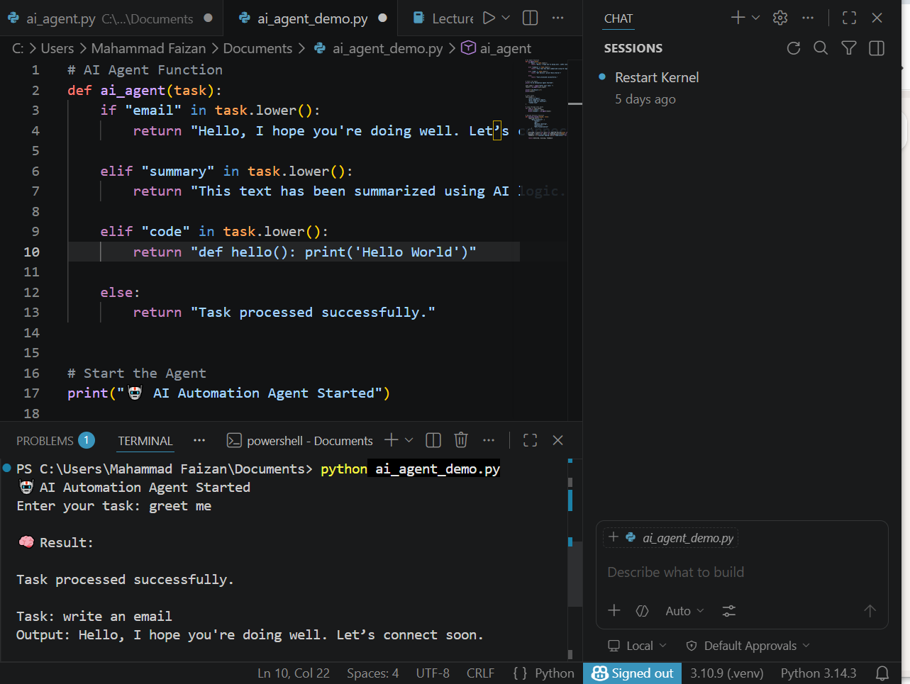
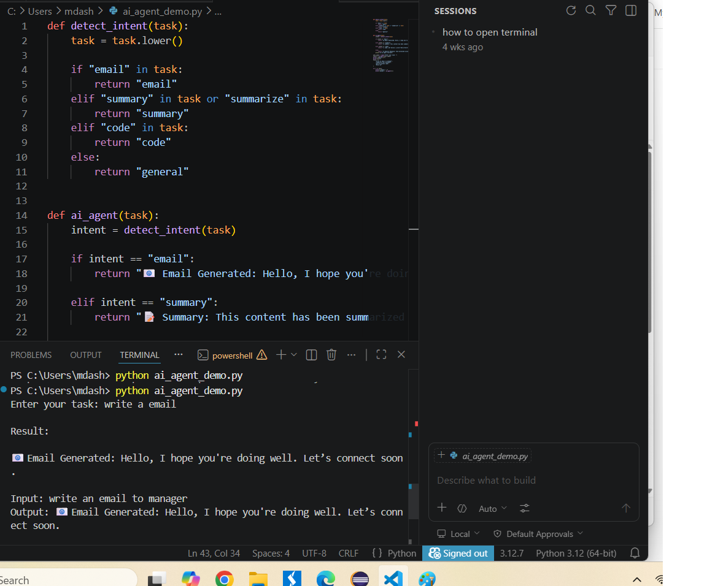
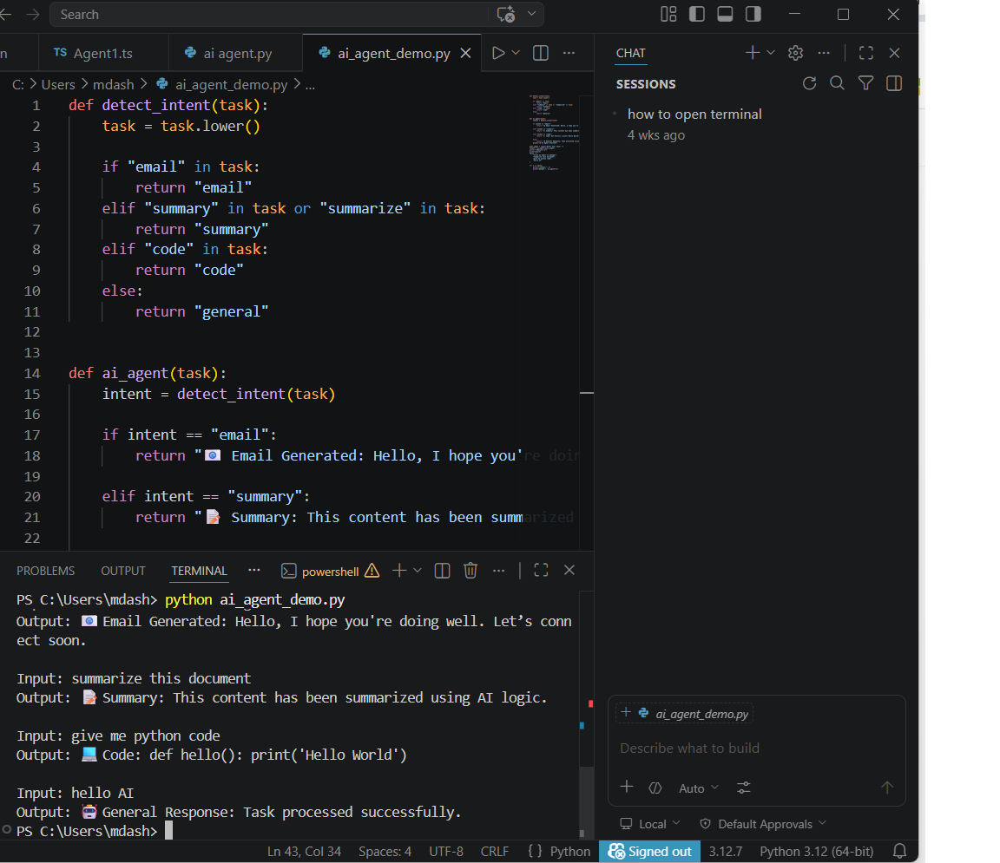

# 🤖 AI Resume Analyzer (LLM + RAG Inspired)

## 🚀 Project Overview

This project is an AI-powered Resume Analyzer that simulates how modern LLM and RAG-based systems evaluate resumes.This project is a simple AI agent that performs multiple tasks such as email generation, text summarization, and code suggestions based on user input.

It demonstrates basic Natural Language Processing (NLP) style intent detection and task routing.

---

It analyzes resumes based on job roles and provides:
- Skill matching
- Gap analysis
- Intelligent feedback

  ## ⚙️ Features
- Email generation
- Text summarization
- Code suggestion
- Intent detection (rule-based NLP)

The system mimics how AI models process input and generate insights.

How It Works
1. User enters a task
2. System detects intent using keyword-based NLP logic
3. Appropriate response is generated
---

## 💡 Problem Statement
Many tasks like data processing, content writing, and analysis are:
- Time-consuming
- Repetitive
- Error-prone

---

## 🧠 Solution
This project builds an AI agent that:
- Takes user input
- Processes it using an LLM
- Generates intelligent outputs
- Automates workflows
- ## 🧠 AI Capabilities
This agent can:
- Generate emails
- Summarize text
- Suggest code snippets
- Handle general automation tasks

  ## 🧠 AI Concepts Implemented

- AI Agents
- Prompt-style processing
- RAG (Retrieval-Augmented Generation) simulation
- Rule-based LLM behavior

  ## 🎯 Key Features

- Resume skill extraction
- Job-role based evaluation
- Missing skill detection
- Intelligent feedback generation

---

## ⚙️ Tech Used
- Python
- AI / LLM

## 📸 Screenshots
###AI Agent Running Output

## Notebook Demo
check the working demo here:
notebooks/ai_agent.ipynb
notebooks/AI Multi Task AI Agent.ipynb

## 🔮 Future Improvements
- Integrate OpenAI API
- Use spaCy for real NLP
- Add Streamlit UI
- Add resume analyzer module
## 👩‍💻 Author
Arshie Fatima

